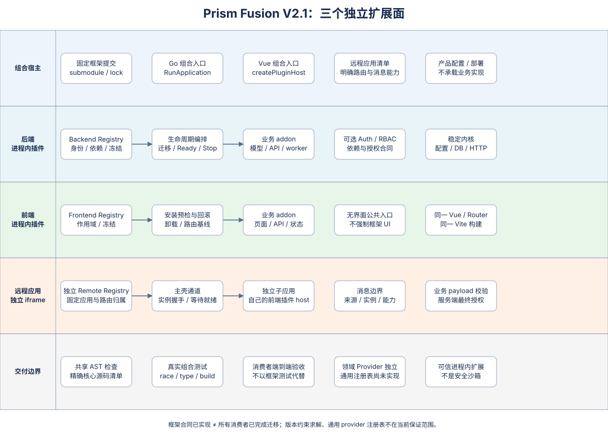
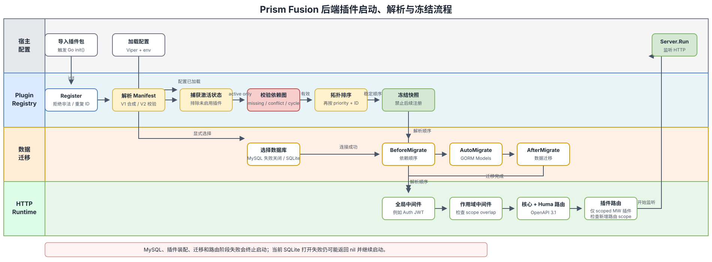

# Prism Fusion 整体架构

状态：基于 Prism Fusion Plugin Specification V2.0 的当前实现整理。

## 1. 架构结论

Prism Fusion 当前采用的是 **模块化单体内核 + 进程内插件图 + 业务宿主显式组合**：

- `prism-fusion` 提供稳定的后端运行时、前端运行时、插件合同和可选基础插件；
- 业务项目（例如 `prism-example-site`）固定框架版本，并组合业务插件；
- 后端 V2 插件用 Manifest 显式声明身份、依赖、冲突和路由作用域，启动时统一校验、排序、冻结；
- 前端插件是同一 Vite 构建中的 `PluginModule`，已有独立 V2 注册表、依赖与作用域校验、安装回滚；框架内插件自动发现，业务插件由宿主显式注入；
- Auth 与 RBAC 是可关闭的框架 addon，不属于框架内核。RBAC 依赖 Auth，并通过领域专用的授权解析器桥接；
- Remote Application 和通用 Strategy Provider 注册表不属于 V2.0 已实现范围。

可编辑源文件：[architecture-overview.drawio](architecture-overview.drawio)。

## 2. 责任边界

| 边界 | 负责什么 | 不负责什么 |
| --- | --- | --- |
| 框架内核 | 配置、日志、数据库接入、HTTP/OpenAPI、插件注册/解析/启动编排、前端壳能力 | 具体业务流程和业务数据模型、完整通用生命周期 |
| 内置 addon | Auth、RBAC 等可选通用能力 | 改变内核合同、隐式接管其他插件路由 |
| 业务宿主 | 固定框架版本、选择插件、提供配置、组装前后端、部署 | 绕过插件依赖校验或直接修改 submodule |
| 业务插件 | 自己的模型、迁移、路由、中间件、页面、菜单与权限点 | 修改其他插件状态或依赖未声明的启动顺序 |

这里的“全插件化”指业务能力通过 addon 扩展，而不是内核本身也插件化。配置加载、注册表冻结、数据库连接、HTTP Server 和前端启动器仍是稳定内核。

## 3. 后端插件模型

### 3.1 V1 与 V2 的兼容关系

基础 `Plugin` 接口保持不变，包含名称、优先级、路由、模型以及全局/作用域中间件等运行时入口。V2 插件额外实现 `ManifestProvider`；V1 插件由框架合成 `prism-fusion/v1` 兼容 Manifest。因此 V2 是增量合同，不要求已有插件一次性重写。

V2.0 Manifest 当前有效字段包括：

- `id`、`version`、`kind`、`description`；
- `provides` 能力元数据；
- `requires`、`optional`、`conflicts`；
- `routeScopes`。

当前仅允许 `backend-addon`。`strategy-provider` 常量虽然已预留，但注册时会拒绝；依赖版本约束同样是预留字段，V2.0 对非空约束执行失败关闭。

### 3.2 注册与解析

后端包通过空白导入触发 `init()`，再调用 `plugin.Register`。注册阶段会校验插件和 Manifest，并拒绝空 ID、非法 ID 与重复 ID。

配置加载完成后，注册表在第一次 `Freeze`、`MustResolve` 或兼容的 `Sorted` 调用时完成装配：

1. 捕获 `PluginEnabled()` 的启用状态；
2. 排除未启用插件；
3. 校验必需依赖、已安装冲突和依赖环；
4. 按依赖拓扑排序；
5. 对同一层的插件按 `Priority()`、插件 ID 稳定排序；
6. 冻结注册窗口以及 Manifest、优先级、启用状态和解析顺序快照。

冻结后不再允许注册。`ResolvedPlugin.Plugin` 仍引用原插件实现，因此插件内部可变状态不属于冻结保证；迁移、中间件与路由消费的是同一份装配元数据和解析顺序，避免不同启动阶段出现顺序漂移。

可编辑源文件：[plugin-startup-flow.drawio](plugin-startup-flow.drawio)。

### 3.3 启动编排

当前已经实现的启动阶段是：

`BeforeMigrate -> GORM AutoMigrate -> AfterMigrate -> middleware -> routes -> HTTP serve`

迁移钩子即使插件没有模型也会执行，可用于数据迁移。通用的 `Validate`、`Initialize`、`Start`、`Ready`、`Stop` 尚未进入合同，因为它们必须与启动回滚、就绪状态聚合和逆序关闭一起设计。

### 3.4 路由与中间件隔离

- `GlobalMiddlewares()` 明确作用于整个 Gin 引擎；
- `Middlewares()` 自动限制在插件声明的 `RouteScopes` 内；
- 匹配按路径段边界执行，例如 `/auth` 不会匹配 `/authz`；
- 所有 V1/V2 插件的作用域不得与其他插件重叠，无论是否配置中间件；
- 所有新增路由都必须归属注册它的插件作用域；健康检查、静态资源、文档和 `/api/v1/system` 等核心命名空间不可抢占，也不能通过换 HTTP 方法绕过。

这些约束防止某个插件的鉴权、限流或审计中间件静默影响另一个插件。

## 4. Auth 与 RBAC

Auth 和 RBAC 位于 `src/server/addons`，属于可选能力，不是核心代码：

- Auth 是 V2 addon，优先级为 10，用独立认证端点声明路由作用域，提供 JWT 认证全局中间件、用户和刷新会话模型；
- RBAC 是 V2 `backend-addon`，优先级为 20，显式 `Requires: auth`，管理 API 使用自己的作用域授权中间件；
- RBAC 向 Auth 注册一个窄接口的 authorization resolver。Auth 不导入 RBAC，避免双向依赖；
- 当前 builtin RBAC 直接依赖 builtin Auth 的用户模型、授权 resolver 合同以及可信 actor/permissions 上下文，因此它不是可随意替换的通用 provider 机制；请求链同时继承 Auth 的 JWT 与会话撤销安全保证。

请求的安全链路是：

`请求 -> Auth 全局 JWT 识别 -> 插件路由作用域 -> RBAC/业务权限检查 -> Handler -> GORM`

后端权限码使用 `domain:resource:action` 三段格式；`*:*:*` 仅作为超级管理员运行时授权，不进入权限目录。前端 `v-perms` 负责可见性和交互提示，但真正的授权边界始终在后端。

## 5. 前端插件模型

前端运行时是 Vue 3、Vite、Vue Router、Pinia 与统一 HTTP/session 能力。`PluginModule` 可贡献：

- 路由与菜单元数据；
- 权限声明；
- 全局组件；
- `install`、异步 `setup` 和 `destroy` 钩子。

装配有两条明确路径：

- 框架内 addon：由 `import.meta.glob("../addons/*/index.ts")` 在构建时发现；
- 业务 addon：由宿主先调用 `registerExternalPlugins`，再调用 `installPlugins`。

后端 Manifest 与前端 `PluginModule` 是平行合同，不是同一个跨端注册表。前端已有 `frontend-addon` Manifest、依赖/冲突/环检测、激活快照与冻结。V1 插件仍可无 Manifest 运行，但不能抢占其他插件或核心路由。

启动顺序为 `注册 -> 配置 -> 冻结/解析 -> 路由与组件预检 -> install/setup -> 提交路由/菜单快照 -> Router 就绪 -> mount`。安装失败阻止应用挂载，并逆序销毁已初始化插件、移除贡献。插件必须在 `destroy` 内释放自己的副作用；内置 Auth/RBAC 的策略与监听器也按此清理。该机制不承诺任意网络副作用可回滚。

路由只从 PluginModule 进入，不再扫描 addon 内的 router 文件。退出登录后恢复已提交的核心与插件路由快照，不会丢失业务路由。宿主通过 `configurePluginHost({ homePath })` 指定首页，业务插件不覆盖 `/`。后端菜单仅更新已声明页面的显示元数据，不创建业务路由或注入组件；菜单合并不会重复增加插件记录。

前端插件注册信息上报的是框架核心 `/api/v1/system/plugin-registry`，当前仅记录日志用于观测，不写入 RBAC，也不参与权限或菜单种子同步；后端 `RegisterPermissions` / `RegisterMenus` 才是 RBAC 种子来源。通用 HTTP/session 协调位于 core，具体认证 API 留在 Auth addon，避免内核反向依赖 addon。

## 6. 数据、配置与运行时

- 配置由 Viper/YAML/环境变量载入，必须先于插件激活状态冻结；
- 如果配置了 MySQL，连接或配置失败会终止启动，不会静默切换到 SQLite；
- 只有未选择 MySQL 时才使用显式配置的 SQLite；
- 当前 SQLite 打开/连接失败会返回 `nil`，`main` 可能跳过迁移后继续启动，这是现状风险，不应被视为目标行为；
- HTTP 层由 Gin 承载，Huma 生成 OpenAPI 3.1，并提供 ReDoc/Scalar；
- API 主路径使用 `{code,message,data}` 信封；
- Go 进程同时提供 API、健康检查和构建后的前端静态资源；
- Docker 多阶段构建负责前后端产物，CI 负责测试、race、vet、构建和健康检查。

## 7. 业务宿主如何集成

`prism-example-site` 是当前的组合示例与兼容性验收宿主：

- git submodule 固定 `prism-fusion` 提交；
- Go 侧通过 `go.work`/本地 `replace` 指向仓库内 submodule；
- 前端通过 pnpm workspace 和 Vite alias 使用 `prism-fusion-web`；
- `example` 是 V2 插件，显式依赖 `auth` 与 `rbac`；
- `dashboard`、`messages`、`site-info` 暂留 V1，用于持续验证向后兼容；
- UI 权限指令与后端权限中间件共同覆盖业务操作。

推荐的新业务插件采用“一项业务能力，一个前后端 addon 对”的组织方式；如果只有后端任务或只有前端页面，也允许只实现一端，但不能假设另一端会被自动发现。

## 8. 当前已实现与后续演进

| 能力 | 当前状态 |
| --- | --- |
| 后端 V1 兼容 | 已实现 |
| 后端 V2 Manifest 校验 | 已实现 |
| 启用状态快照、依赖排序、冲突/环检测、冻结 | 已实现 |
| 迁移钩子与统一解析顺序 | 已实现 |
| 路由作用域与中间件隔离 | 已实现 |
| Auth/RBAC 领域桥接 | 已实现，但只针对当前 builtin 组合 |
| 前端业务插件显式注入 | 已实现 |
| 前端 V2 依赖图与激活合同 | 已实现，保留 V1 兼容 |
| 前端路由预检、安装回滚与重置快照 | 已实现；插件自行清理钩子副作用 |
| 核心/业务代码机械边界 CI | 已实现，共享 TypeScript/Go AST 检查器 |
| 通用 Strategy Provider 注册表 | 尚未实现 |
| Remote Application Manifest | 尚未实现 |
| 后端完整 Start/Ready/Stop 与失败回滚 | 尚未实现 |
| 依赖版本约束求解 | 尚未实现 |

除表中演进项外，SQLite 初始化也应在后续改为失败关闭，使所有显式选择的数据存储遵循一致的启动语义。

后续演进应维持三个独立扩展面：Backend Addon、Frontend Addon、Remote Application。通用 provider 也应使用 `domain + providerName` 复合身份和显式选择，不应通过重复插件 ID 覆盖实现。

### 8.1 如何验收“业务插件化”

框架及 example CI 共用 `scripts/architecture/guard.mjs`，检查核心源码清单、依赖方向、业务 API/模型/Store 和路由变更。新业务代码应进入 addon；新增核心能力需要同时评审源码和策略，不是随手放进允许目录即可。example 的站点页脚已回归 `site-info`，入口只保留组装。

能保证的是：当前接入检查的仓库，其声明与源码满足已定义的机械边界，违规样例会被测试和 CI 拒绝。不能声称任意函数内部绝无业务语义，或可信进程内插件等同安全沙箱；也不能把 example 验收等同其他所有服务已完成迁移。新增消费者仍须接入同一检查与端到端验收。详见 [插件规范](plugin-spec-v2.md#11-architecture-enforcement-and-limits)。

## 9. 关键设计不变量

1. 框架内核不承载业务逻辑；Auth/RBAC 也必须保持可选 addon 身份。
2. 配置先加载，插件状态后冻结；冻结后的装配结果不可变。
3. 依赖关系优先于人工优先级，所有启动阶段共享同一顺序。
4. 中间件作用域必须可验证，不能跨插件隐式泄漏。
5. 后端是最终授权边界，前端权限只改善体验。
6. 业务宿主固定框架版本，框架升级与宿主适配作为两个独立提交处理。
7. 规划中的合同必须明确标注为未实现，不能通过预留常量暗示已经支持。

## 10. 本轮验证与已知限制

2026-09-05 本地验证：前端 69 项会话、插件、导航、宿主和 provider 回归通过；另有真实 Element Plus 依赖加载检查。Registry/Runtime/导航模块行覆盖率为 99.23%，架构检查器 17 项测试通过、行覆盖率为 93.43%。后端全量 `go test -race ./...`、`go vet ./...`、`go build ./...` 通过。

覆盖率不能混用口径：后端 `plugin` 包为 84.2%，`initialize` 包的普通单元统计为 34.0%（独立子进程启动用例不合并到该统计）。这不是全仓达到 80% 覆盖率的声明。

构建验收额外发现旧锁文件中的 `lodash-es 4.18.0` 运行时错误；框架和示例站统一锁定 `4.18.1`，并从 Element Plus 的实际依赖位置执行回归检查。生产包不再启用旧 mock server；页面离开清理使用 `pagehide`，避免现代浏览器对 `unload` 的策略错误。

自动化检查不能替代浏览器与接口验收。框架使用隔离 SQLite、随机测试凭据验证 `/health`、注册、登录、RBAC 身份和菜单实际返回；未认证 RBAC 请求必须是预期的 401。前端构建、类型检查及依赖审计是 CI 的必过步骤。

浏览器验收还发现退出登录的时序竞争：跳转发生在 Web Lock 清除凭据之前，会被守卫挡回首页。现在凭据清理完成后才在同一锁内重置界面并导航；新增延迟锁与清理失败测试，避免只验证静态路由快照而遗漏真实登录流程。
